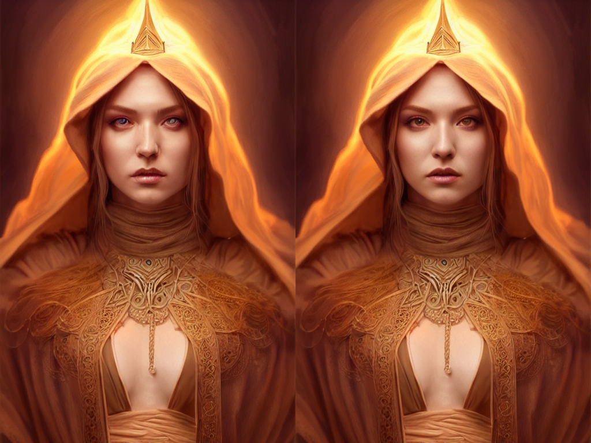
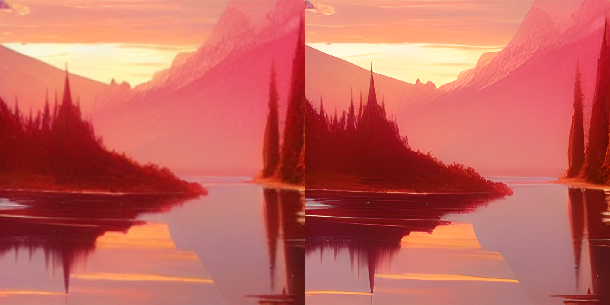
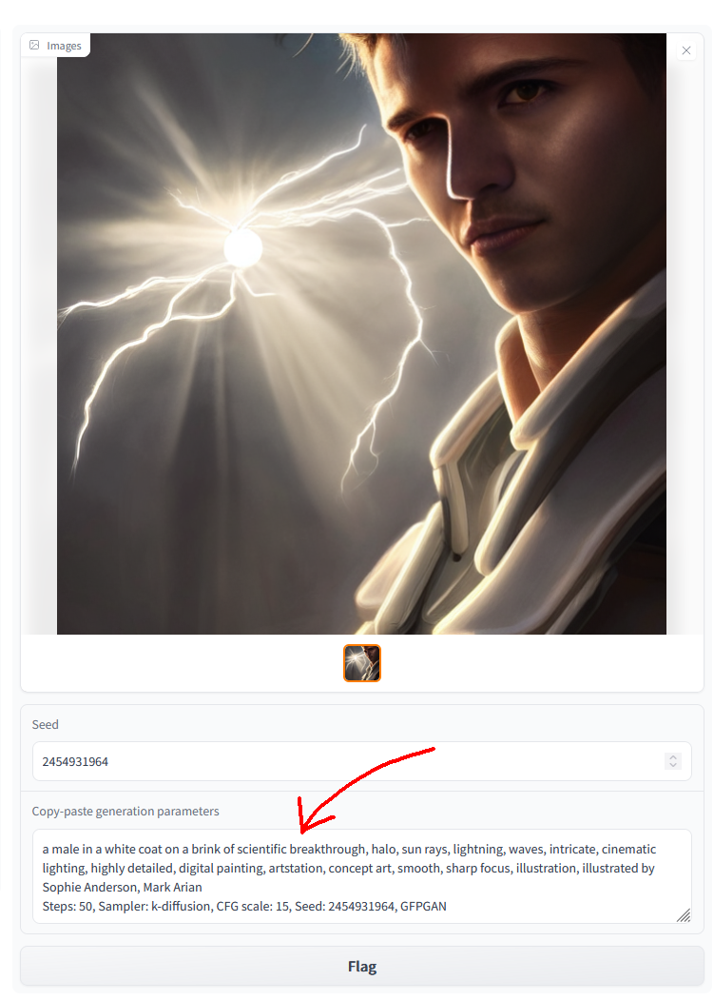

Features:

* Gradio GUI: Idiot-proof, fully featured frontend for both txt2img and img2img generation
* No more manually typing parameters, now all you have to do is write your prompt and adjust sliders
* :fire::fire: Mask and crop :fire::fire:
* Textual inversion 🔥: [info](https://textual-inversion.github.io/) - requires enabling, see [here](https://github.com/hlky/sd-enable-textual-inversion), script works as usual without it enabled
* Mask painting (NEW) 🖌️: Powerful tool for re-generating only specific parts of an image you want to change
* Loopback (NEW) ➿: Automatically feed the last generated sample back into img2img
* Prompt Weighting (NEW) 🏋️: Adjust the strength of different terms in your prompt
* GFPGAN Face Correction 🔥: Automatically correct distorted faces with a built-in GFPGAN option, fixes them in less than half a second
* RealESRGAN Upscaling 🔥: Boosts the resolution of images with a built-in RealESRGAN option (advanced users only to avoid breaking for non-advanced users, requires environment.yaml change (maybe))
* More k_diffusion samplers 🔥🔥 : Far greater quality outputs than the default sampler, less distortion and more accurate
* CFG: Classifier free guidance scale, a feature for fine-tuning your output
* Memory Monitoring 🔥: Shows Vram usage and generation time after outputting.
* Word Seeds 🔥: Use words instead of seed numbers
* Launcher Automatic 👑🔥 shortcut to load the model, no more typing in Conda
* Lighter on Vram: 512x512 img2img & txt2img tested working on 6gb
* and ????

# Stable Diffusion web UI
A browser interface based on Gradio library for Stable Diffusion.

Original script with Gradio UI was written by a kind anonymopus user. This is a modification.


### GFPGAN

If you want to use GFPGAN to improve generated faces, you need to install it separately.
Follow instructions from https://github.com/TencentARC/GFPGAN, but when cloning it, do so into Stable Diffusion main directory, `/sd`.
After that download [GFPGANv1.3.pth](https://github.com/TencentARC/GFPGAN/releases/download/v1.3.0/GFPGANv1.3.pth) and put it
into the `/sd/GFPGAN/experiments/pretrained_models` directory. If you're getting troubles with GFPGAN support, follow instructions
from the GFPGAN's repository until `inference_gfpgan.py` script works.

If the GFPGAN directory does not exist, you will not get the option to use GFPGAN in the UI. If it does exist, you will either be able
to use it, or there will be a message in console with an error related to GFPGAN.

### RealESRGAN
If you want to use RealESRGAN to upscale generated images, you need to install it separately.
Follow instructions from https://github.com/xinntao/Real-ESRGAN, but when cloning it, do so into Stable Diffusion main directory, `/sd`.
After that download [RealESRGAN_x4plus.pth](https://github.com/xinntao/Real-ESRGAN/releases/download/v0.1.0/RealESRGAN_x4plus.pth) and [RealESRGAN_x4plus_anime_6B.pth](https://github.com/xinntao/Real-ESRGAN/releases/download/v0.2.2.4/RealESRGAN_x4plus_anime_6B.pth).
Put them into the `/sd/RealESRGAN/experiments/pretrained_models` directory. If you're getting troubles with RealESRGAN support, follow instructions from the RealESRGAN's repository until `inference_realesrgan.py` script works.

If the RealESRGAN directory does not exist, you will not get the option to use RealESRGAN in the UI. If it does exist, you will be either able
to use it, or there will be a message in console with an error related to RealESRGAN.

### Web UI

When launching, you may get a very long warning message related to some weights not being used. You may freely ignore it.
After a while, you will get a message like this:

```
Running on local URL:  http://127.0.0.1:7860/
```

Open the URL in browser, and you are good to go.

## Features
The script creates a web UI for Stable Diffusion's txt2img and img2img scripts. Following are features added
that are not in original script.

### GFPGAN
Lets you improve faces in pictures using the GFPGAN model. There is a checkbox in every tab to use GFPGAN at 100%, and
also a separate tab that just allows you to use GFPGAN on any picture, with a slider that controls how strongthe effect is.



### RealESRGAN
Lets you double the resolution of generated images. There is a checkbox in every tab to use RealESRGAN, and you can choose between the regular upscaler and the anime version.
There is also a separate tab for using RealESRGAN on any picture.



### Sampling method selection
Pick out of three sampling methods for txt2img: DDIM, PLMS, k-diffusion:


### Prompt matrix
Separate multiple prompts using the `|` character, and the system will produce an image for every combination of them.
For example, if you use `a busy city street in a modern city|illustration|cinematic lighting` prompt, there are four combinations possible (first part of prompt is always kept):

- `a busy city street in a modern city`
- `a busy city street in a modern city, illustration`
- `a busy city street in a modern city, cinematic lighting`
- `a busy city street in a modern city, illustration, cinematic lighting`

Four images will be produced, in this order, all with same seed and each with corresponding prompt:


Another example, this time with 5 prompts and 16 variations:


If you use this feature, batch count will be ignored, because the number of pictures to produce
depends on your prompts, but batch size will still work (generating multiple pictures at the
same time for a small speed boost).

### Flagging
Click the Flag button under the output section, and generated images will be saved to `log/images` directory, and generation parameters
will be appended to a csv file `log/log.csv` in the `/sd` directory.

> but every image is saved, why would I need this?

If you're like me, you experiment a lot with prompts and settings, and only few images are worth saving. You can
just save them using right click in browser, but then you won't be able to reproduce them later because you will not
know what exact prompt created the image. If you use the flag button, generation paramerters will be written to csv file,
and you can easily find parameters for an image by searching for its filename.

### Copy-paste generation parameters
A text output provides generation parameters in an easy to copy-paste form for easy sharing.



If you generate multiple pictures, the displayed seed will be the seed of the first one.

### Correct seeds for batches
If you use a seed of 1000 to generate two batches of two images each, four generated images will have seeds: `1000, 1001, 1002, 1003`.
Previous versions of the UI would produce `1000, x, 1001, x`, where x is an iamge that can't be generated by any seed.

### Resizing
There are three options for resizing input images in img2img mode:

- Just resize - simply resizes source image to target resolution, resulting in incorrect aspect ratio
- Crop and resize - resize source image preserving aspect ratio so that entirety of target resolution is occupied by it, and crop parts that stick out
- Resize and fill - resize source image preserving aspect ratio so that it entirely fits target resolution, and fill empty space by rows/columns from source image

Example:


### Loading
Gradio's loading graphic has a very negative effect on the processing speed of the neural network.
My RTX 3090 makes images about 10% faster when the tab with gradio is not active. By default, the UI
now hides loading progress animation and replaces it with static "Loading..." text, which achieves
the same effect. Use the --no-progressbar-hiding commandline option to revert this and show loading animations.

### Prompt validation
Stable Diffusion has a limit for input text length. If your prompt is too long, you will get a
warning in the text output field, showing which parts of your text were truncated and ignored by the model.

### Loopback
A checkbox for img2img allowing to automatically feed output image as input for the next batch. Equivalent to
saving output image, and replacing input image with it. Batch count setting controls how many iterations of
this you get.

Usually, when doing this, you would choose one of many images for the next iteration yourself, so the usefulness
of this feature may be questionable, but I've managed to get some very nice outputs with it that I wasn't abble
to get otherwise.

Example: (cherrypicked result; original picture by anon)


